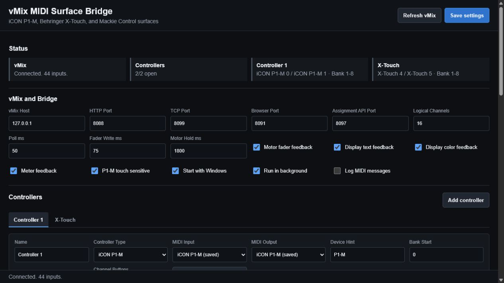
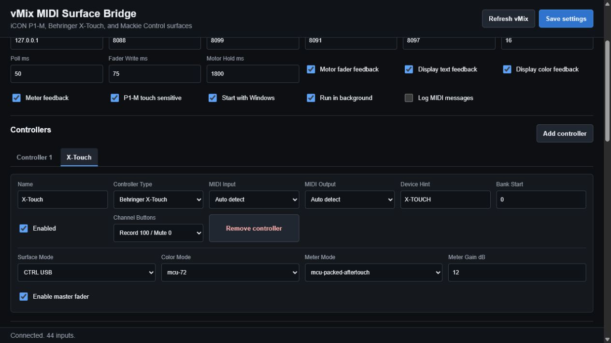

# vMix MIDI Surface Bridge

Use one or more MIDI control surfaces to operate vMix audio from real faders, buttons, meters, and scribble-strip displays. The bridge runs quietly in the background and its complete configuration interface opens in a web browser.

Supported and tested controllers:

- iCON P1-M in Mackie Control / MCU mode
- Behringer X-Touch in CTRL USB mode
- Additional Mackie Control compatible surfaces

Multiple controllers can run at the same time with independent MIDI ports, channel banks, assignments, labels, and colors.



## Quick Install For Windows

1. Download [VMixMidiSurfaceBridge-Setup.exe](https://github.com/wtapper89/Icon-P1-M-Vmix-Bridge/raw/main/release/VMixMidiSurfaceBridge-Setup.exe).
2. Double-click the downloaded file.
3. If Windows SmartScreen appears, choose **More info**, then **Run anyway**. The installer is not code-signed yet.
4. Wait for the browser to open at [http://localhost:8091/](http://localhost:8091/).
5. Connect each controller, add or select its tab, and click **Save settings**.

The setup executable installs Python automatically through Windows Package Manager when necessary. It then installs the MIDI dependencies, creates a startup task named **vMix MIDI Surface Bridge**, starts the bridge, and opens the browser interface.

Existing settings from the earlier **vMix X-Touch Bridge** installation are migrated automatically.

## Prepare vMix

1. Open vMix.
2. Open **Settings > Web Controller**.
3. Enable the Web Controller/API.
4. Leave the vMix HTTP port at `8088` unless your vMix installation uses another port.
5. Leave the bridge browser port at `8091`; port `8088` belongs to vMix.

The Status section should report `Connected` and show the number of vMix inputs found.

## Add Controllers

Each controller has its own tab and can use a different bank of the same logical channel list.

1. Click **Add controller**.
2. Enter a recognizable name.
3. Choose **iCON P1-M**, **Behringer X-Touch**, or **Mackie Control**.
4. Select the MIDI input and output, or leave them on automatic detection and provide a device hint.
5. Enable the controller and click **Save settings**.



Do not choose `Microsoft GS Wavetable Synth` as a controller output.

### iCON P1-M

- Put the P1-M in Mackie Control / MCU mode.
- Use the P1-M MIDI input and output ports.
- Record moves the assigned level to `100`; Mute moves it to `0`.
- Motor faders, meters, labels, and strip colors follow vMix.

### Behringer X-Touch

- Put the X-Touch in **CTRL USB** mode.
- Choose **CTRL USB** as the Surface Mode in its controller tab.
- Record moves the assigned level to `100`; Mute moves it to `0`.
- Fader Bank Left/Right and the jog wheel change banks.
- Bank, Record, and Mute LEDs reflect the active state.
- The bridge automatically reconnects and restores the surface after a power cycle.

## Assign vMix Channels

The Channel Assignments table is shared by all controllers. Each row can control:

- A vMix input
- The source currently in Program (PGM)
- The source currently in Preview (PVW)
- Master
- Bus A through Bus G
- Nothing

For each channel, choose an assignment, select the vMix input when needed, optionally enter a short label override, and choose a strip color. The highlighted eight rows are the bank currently shown on the selected controller.

Program and Preview assignments follow vMix dynamically. After a cut or preview selection, the surface label, meter, motor fader, Record/Mute buttons, and fader movement automatically target the newly selected source.

Use **Bank left**, **Bank right**, controller bank buttons, or the X-Touch jog wheel to move through additional channels.

## Startup And Files

The bridge starts when the current Windows user signs in. Open the interface at:

```text
http://localhost:8091/
```

Installed files and settings are stored under:

```text
%LOCALAPPDATA%\VMixMidiSurfaceBridge
```

The primary settings file is `config.json`. Reinstalling or upgrading preserves it.

## Manual Installation

For development or machines where the setup executable cannot be used:

```powershell
git clone https://github.com/wtapper89/Icon-P1-M-Vmix-Bridge.git
cd Icon-P1-M-Vmix-Bridge
powershell -ExecutionPolicy Bypass -File .\install_on_windows.ps1
```

Python 3 and Windows PowerShell are required. The script creates an isolated virtual environment and installs the pinned dependencies from `requirements.txt`.

## Troubleshooting

### vMix is not connected

- Confirm vMix is open.
- Confirm the vMix Web Controller/API is enabled.
- Confirm the vMix host is `127.0.0.1` when vMix runs on the same computer.
- Confirm the vMix HTTP port is `8088`.

### A controller is not connected

- Power-cycle the controller and wait a few seconds.
- Confirm its MIDI input and output appear in Windows.
- Confirm another application is not holding the MIDI ports.
- Check that the controller Device Hint matches its Windows MIDI name.

### Buttons or faders use the wrong channel

- Select the correct controller tab and check its current bank.
- Confirm the channel assignment is not set to `None`.
- Enable **Log MIDI messages** temporarily when diagnosing an unusual controller mapping.
- Logs are stored in `%LOCALAPPDATA%\VMixMidiSurfaceBridge\logs`.

### The browser does not open

Open [http://localhost:8091/](http://localhost:8091/) manually. In Task Scheduler, confirm **vMix MIDI Surface Bridge** is running.

## Development

Run the focused controller tests with the installed virtual environment:

```powershell
%LOCALAPPDATA%\VMixMidiSurfaceBridge\.venv\Scripts\python.exe -m unittest discover -s tests -v
```

Build the Windows setup executable with the .NET Framework compiler included with Windows:

```powershell
powershell -ExecutionPolicy Bypass -File .\build-installer.ps1
```

The generated installer is written to `release\VMixMidiSurfaceBridge-Setup.exe`.

## Local APIs

- Browser UI: `http://localhost:8091/`
- Health: `GET /api/health`
- Status: `GET /api/status`
- Current assignments: `GET /api/assignments`
- Assignment API: configured separately in the browser interface, default `8097`

The APIs bind locally by default and are intended for trusted production computers and local automation.
